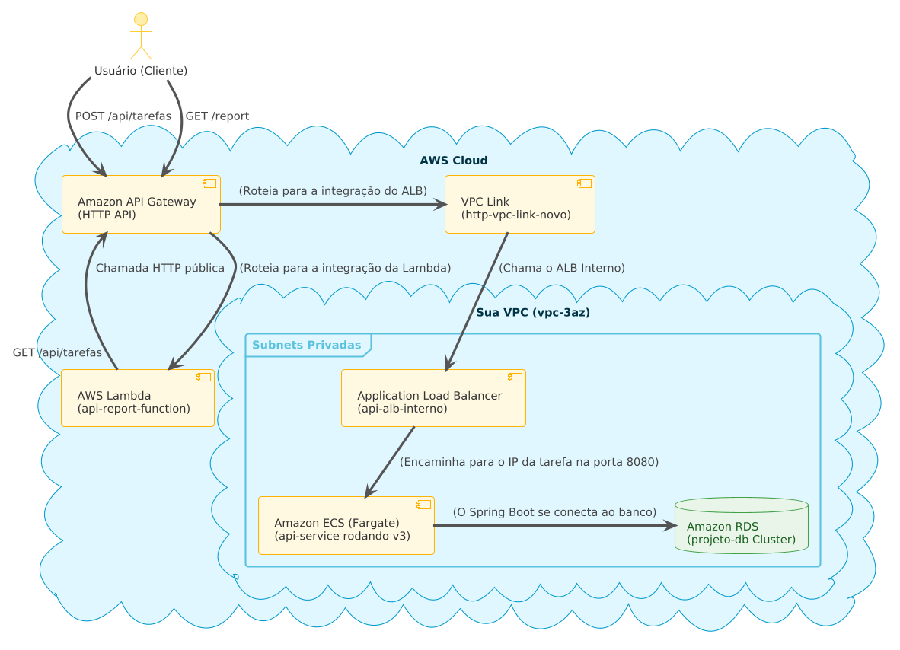

# Projeto Integrador – Cloud Developing 2025/1

> CRUD simples + API Gateway + Lambda /report + RDS + CI/CD

**Grupo**:
<!-- no máximo 5 alunos -->

1. 10418331 - Rafael Riki - Responável pela parte prática, fez o backend e implementou na AWS.
2. 10402805 - Henrique Higa - Responsável pela parte teórica, ficou encarregado de fazer os entregáveis e fez o código do Lambda.

## 1. Visão geral
<!-- Descreva rapidamente o domínio escolhido, por que foi selecionado e o que o CRUD faz. -->
O domínio escolhido para o projeto foi um Sistema de Gerenciamento de Tarefas. A principal entidade é a Tarefa, que tem os seguintes atributos: id, descricao, titulo e concluido.
Escolhemos esse tema porque ele é simples e direto, sem muita complexidade.
O crud faz as seguintes ações:
POST /api/tarefas – Cria uma nova tarefa. Recebe um JSON com a descrição e o status de concluída ou não.
GET /api/tarefas – Retorna todas as tarefas cadastradas no banco em formato JSON.
GET /api/tarefas/{id} – Retorna uma tarefa específica pelo seu ID.
PUT /api/tarefas/{id} – Atualiza a descrição ou o status de uma tarefa existente.
DELETE /api/tarefas/{id} – Remove uma tarefa do banco de dados.
E o /report do Lambda que retorna a quantidade total de todas as tarefas e a quantide de tarefas concluidas e pendentes.


## 2. Arquitetura



| Camada | Serviço | Descrição |
|--------|---------|-----------|
| Backend | ECS Fargate (ou EC2 + Docker) | API REST Node/Spring/… |
| Banco   | Amazon RDS              | PostgreSQL / MySQL em subnet privada |
| Gateway | Amazon API Gateway      | Rotas CRUD → ECS · `/report` → Lambda |
| Função  | AWS Lambda              | Consome a API, gera estatísticas JSON |
| CI/CD   | CodePipeline + GitHub   | push → build → ECR → deploy |

## 3. Como rodar localmente

```bash
cp .env.example .env         # configure variáveis
docker compose up --build
# API em http://localhost:3000
